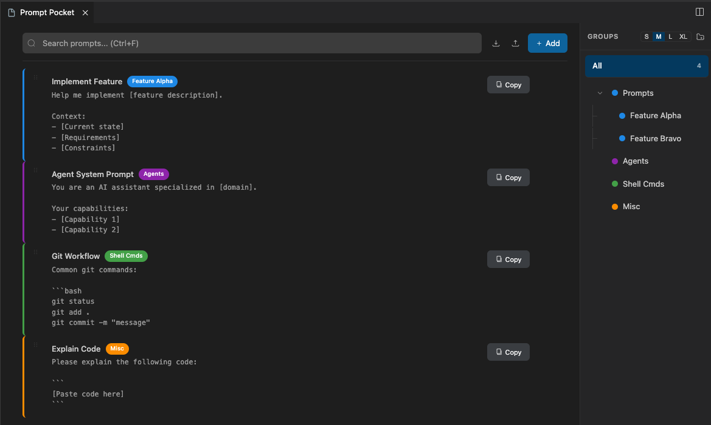
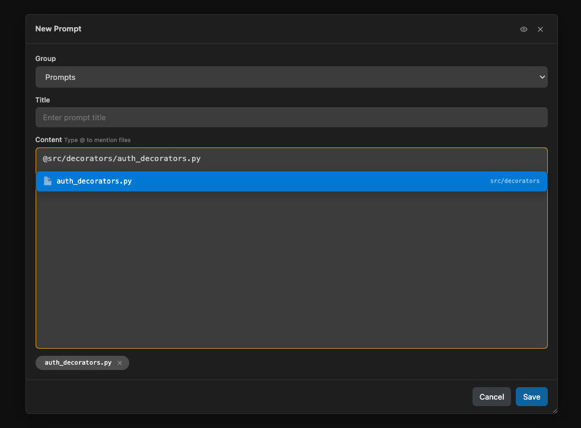

# Prompt Pocket

A lightweight VS Code extension for organizing and quickly copying reusable prompts. Perfect for AI interactions, code snippets, and templates.



## Features

- **Hierarchical Organization**: Organize prompts into groups and subgroups
- **One-Click Copy**: Click any prompt to copy to clipboard
- **File Mentions**: Type `@` to attach files from your workspace
- **Quick Search**: Fast search across all prompts
- **Import/Export**: Backup and share prompt libraries as JSON
- **Webview Editor Panel**: Search-first interface that opens as an editor tab (`Cmd+Shift+P` `Cmd+O`)
- **100% Local**: No telemetry, no accounts, no cloud syncing



## Installation

### From Source (Cursor/VS Code)

```bash
cd prompt-pocket
./install.sh
```

The script installs dependencies, compiles TypeScript, packages the extension, and installs to Cursor/VS Code.

### Manual Installation

1. Build: `pnpm install && pnpm run compile && pnpm run package`
2. Open VS Code/Cursor → `Cmd+Shift+P` → "Extensions: Install from VSIX"
3. Select the `.vsix` file

## Usage

### Quick Start

1. Click the 📝 icon in the Activity Bar
2. Open the editor panel: `Cmd+Shift+P` → `Cmd+O`
3. Create a prompt: Click `+` button or right-click a group → "New Prompt"
4. Copy a prompt: Click any prompt in the tree or panel

### Creating Prompts

- **New Group**: Click `+` in toolbar
- **New Prompt**: Right-click group → "New Prompt"
- **Edit Content**: Right-click prompt → "Edit Content"
- **Attach Files**: Type `@` in the content editor to mention workspace files

### Managing Prompts

- **Search**: Type in the search box to filter prompts
- **Duplicate**: Right-click → "Duplicate"
- **Import/Export**: Use toolbar icons to backup or share prompt libraries
- **Delete**: Right-click → "Delete"

## Configuration

Prompt Pocket works out of the box with zero configuration. All data is stored locally in VS Code's GlobalState.


### Available Settings

Currently, all features are enabled by default. Configuration options may be added in future releases.

### Data Format

Exported JSON structure:

```json
{
  "groups": [
    {
      "id": "unique-id",
      "name": "Group Name",
      "children": [],
      "prompts": [
        {
          "id": "unique-id",
          "title": "Prompt Title",
          "content": "Prompt content here..."
        }
      ]
    }
  ]
}
```

## Development

### Prerequisites

- Node.js 20.x or higher
- pnpm 9.x or higher
- VS Code 1.85.0 or higher

### Build Commands

```bash
pnpm install          # Install dependencies
pnpm run compile      # Compile TypeScript
pnpm run watch        # Watch mode for development
pnpm run lint         # Lint code
pnpm run test         # Run tests
pnpm run package      # Create .vsix package
```

### Development Workflow

1. Edit TypeScript files in `src/`
2. Run `pnpm run watch` or compile manually
3. Press `F5` to launch Extension Development Host
4. Set breakpoints and debug as needed

### Project Structure

```
src/
├── extension.ts         # Entry point & command handlers
├── webviewPanel.ts      # Webview editor panel
├── storage.ts           # Data persistence (GlobalState)
├── treeDataProvider.ts  # TreeView implementation
├── types.ts             # Type definitions
└── icons.ts             # Icon management
```

## License

MIT License - see [LICENSE](LICENSE) file for details.
