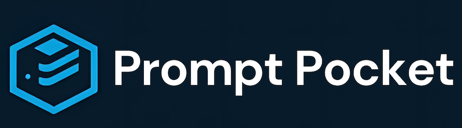
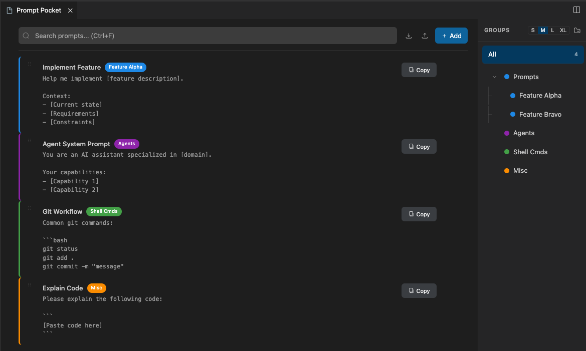
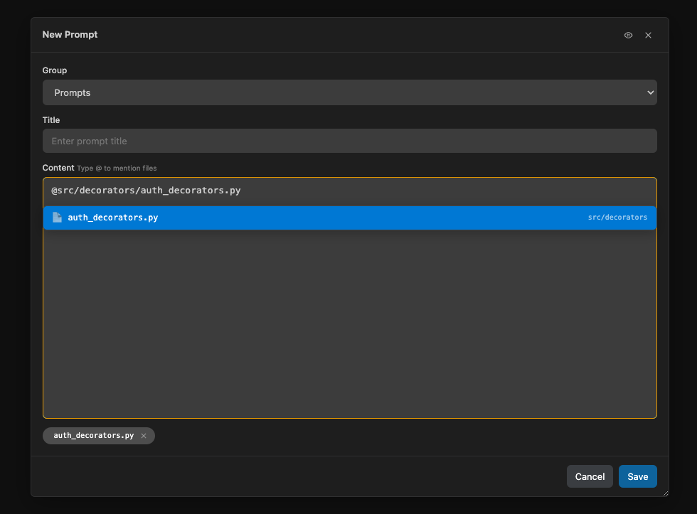

<div align="center">



A lightweight VS Code extension for organizing and quickly copying reusable prompts. Perfect for AI interactions, code snippets, and templates.

</div>



## Features

- **Hierarchical organization**: group prompts and nest one level of subgroups
- **One-click copy**: click any prompt in the tree or panel to copy it to the clipboard
- **Run (▶) button**: send any prompt to Copilot Chat, insert it at your cursor, pipe it to a dedicated terminal, or just copy it — your choice via `promptPocket.runAction`
- **Editor panel**: search-first webview that opens as a full editor tab
- **Sidebar tree view**: traditional hierarchical navigation in the activity bar
- **File mentions**: type `@` in the prompt editor to attach workspace files; drag-and-drop also works (hold `Shift` when dragging from the Explorer)
- **Markdown preview**: toggle a rendered preview while editing a prompt
- **Quick search**: filter all prompts as you type, with arrow-key navigation
- **Adjustable density**: SM / MD / LG / XL sizing for the groups sidebar
- **Import / export**: back up or share prompt libraries as JSON
- **100% local**: no telemetry, no accounts, no cloud syncing

## Install

- **VS Code** — search for *Prompt Pocket* in the Extensions sidebar, or install from the [Visual Studio Marketplace](https://marketplace.visualstudio.com/items?itemName=cazter.prompt-pocket).
- **Cursor, VSCodium, Gitpod, code-server, and other VS Code forks** — search for *Prompt Pocket* in the Extensions sidebar, or install from the [Open VSX Registry](https://open-vsx.org/extension/cazter/prompt-pocket). Forks of VS Code can't legally pull from Microsoft's marketplace, so we publish to Open VSX in parallel.
- **Manual `.vsix` install** — grab the `.vsix` from the [latest GitHub release](https://github.com/cazter/prompt-pocket/releases/latest), then in your editor: Extensions sidebar → `…` overflow menu → **Install from VSIX…**.

## Getting Started

After installing:

1. Click the Prompt Pocket icon in the Activity Bar to open the sidebar tree.
2. Press `Cmd+Alt+P` (`Ctrl+Alt+P` on Windows / Linux) to open the editor panel in a tab.
3. Click **Add** to create your first prompt, or **+** in the Groups sidebar to create a group first.
4. Click any prompt to copy it to your clipboard.



## Using Prompt Pocket

There are three ways to reach your prompts:

- **Sidebar tree** — Activity Bar → Prompt Pocket. **Click a prompt to open it for editing** in a markdown tab — edits live-autosave back to the prompt as you type (no `Cmd/Ctrl+S` needed). Use the inline copy icon on row hover (or right-click → **Copy Prompt**) to copy without opening the editor. Right-click a group or prompt for create / rename / duplicate / delete actions.
- **Editor panel** — `Cmd+Alt+P` / `Ctrl+Alt+P`. Search-first interface with arrow-key navigation, `Enter` to copy, and `Cmd/Ctrl+N` to start a new prompt while the panel is focused.
- **Command Palette** — `Cmd+Alt+C` / `Ctrl+Alt+C` runs **Copy Prompt from Prompt Pocket**, a quick-pick of every prompt across every group. **Search Prompts** is also available from the palette.

### Editing prompts

Open the editor panel and click **Add** (or right-click a prompt in the tree → **Edit**). The modal supports markdown preview, live `@file` autocomplete, attached-file chips, and resizable bounds. Closing the modal with unsaved changes prompts you to **Save**, **Discard**, or **Cancel**.

### File references

With `promptPocket.enableFileReferences` on (the default), typing `@` inside a prompt opens an autocomplete of workspace files. References are stored as plain `@path/to/file` text inside the prompt, so they travel cleanly through copy / export / import. Folders work too — drop a folder and Prompt Pocket inserts `@path/to/folder`.

**Drag-and-drop tip:** VS Code intentionally hands Explorer drags to the active editor by default. To drop files (or folders) into the Prompt Pocket modal, **start dragging from the Explorer, then hold `Shift`** before releasing over the modal. The modal will highlight to confirm it accepted the drop. Files dragged in from your OS file manager (Finder / Explorer / Files) work without holding `Shift`.

## Keyboard Shortcuts

- `Cmd+Alt+P` / `Ctrl+Alt+P` — Open the Prompt Pocket editor panel
- `Cmd+Alt+C` / `Ctrl+Alt+C` — Copy a prompt from the Command Palette
- `Cmd+N` / `Ctrl+N` — New prompt (only when the editor panel is focused)
- `Cmd+F` / `Ctrl+F` — Focus the search box (when the panel is focused)
- `↑` / `↓` — Move between prompts in the panel
- `Enter` — Copy the highlighted prompt
- `Esc` — Clear the search filter (or close an open modal / dialog)

## Settings

All settings live under `promptPocket.*` in VS Code Settings (`Cmd/Ctrl+,`).

- `promptPocket.showCopyNotification` *(boolean, default `true`)* — show a toast when a prompt is copied to the clipboard.
- `promptPocket.defaultView` *(`"panel"` | `"sidebar"`, default `"panel"`)* — preferred surface when opening Prompt Pocket.
- `promptPocket.confirmDelete` *(boolean, default `true`)* — ask for confirmation before deleting a prompt or group.
- `promptPocket.modalClickOutsideToClose` *(boolean, default `true`)* — allow closing the prompt modal by clicking outside it. Unsaved changes still trigger the confirm dialog.
- `promptPocket.enableFileReferences` *(boolean, default `true`)* — enable `@` file mentions and drag-and-drop file linking inside the prompt editor.
- `promptPocket.runAction` *(`"copilotChat"` | `"insertAtCursor"` | `"terminal"` | `"clipboard"`, default `"copilotChat"`)* — what the Run (▶) button does when clicked on a prompt row in the sidebar tree:
    - `copilotChat` — open the editor's AI chat in Agent mode with the prompt prefilled (Copilot Chat in VS Code 1.95+, Cursor's chat panel in Cursor). Falls back to clipboard if no AI chat is registered (VSCodium / VS Code without Copilot).
    - `insertAtCursor` — insert at the cursor in the active editor (replaces selection); falls back to clipboard if no editor is open.
    - `terminal` — send to a reusable "Prompt Pocket" integrated terminal; no newline is appended so you can review before pressing Enter.
    - `clipboard` — copy to clipboard (same as the Copy button).

## Import / Export

Use the Import and Export buttons in the editor panel toolbar (or the same commands from the sidebar's overflow menu) to back up or share prompt libraries. Exports are timestamped JSON files; imports can either **Merge** with your existing prompts or **Replace** them entirely.

Exported JSON structure:

```json
{
  "groups": [
    {
      "id": "unique-id",
      "name": "Group Name",
      "children": [],
      "prompts": [
        {
          "id": "unique-id",
          "title": "Prompt Title",
          "content": "Prompt content here..."
        }
      ]
    }
  ]
}
```

## Privacy

All prompts are stored locally in VS Code's Global State on your machine. Prompt Pocket has no telemetry, no accounts, and makes no network calls.

## Issues & Contributing

Bug reports, feature requests, and pull requests are welcome at [github.com/cazter/prompt-pocket](https://github.com/cazter/prompt-pocket).

## License

MIT License - see [LICENSE](LICENSE) file for details.
